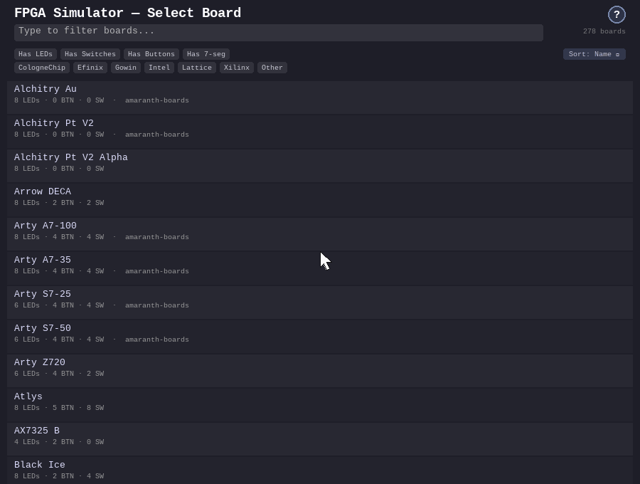

# FPGA Board Simulator

[](https://github.com/Machai-Kydoimos/fpga-board-sim/actions/workflows/ci.yml)
[](https://github.com/Machai-Kydoimos/fpga-board-sim/releases)
[](LICENSE)
[](pyproject.toml)
[](https://github.com/astral-sh/ruff)
[](https://mypy-lang.org/)
[](https://github.com/astral-sh/uv)

*CI matrix: Ubuntu + Windows + macOS (Apple Silicon) + Linux arm64 × Python 3.10 / 3.12 /
3.13, plus simulator jobs — GHDL 6.0 (mcode, LLVM, and LLVM-JIT backends) and NVC on
Linux, GHDL 6.0 on Windows, GHDL 6.0 (LLVM + LLVM-JIT; no mcode on Apple Silicon) and
NVC on macOS — and a board-data drift check.*

Interactive FPGA board simulator for VHDL. Pick from **283 real FPGA board
definitions** (sourced from [amaranth-boards](https://github.com/amaranth-lang/amaranth-boards),
[litex-boards](https://github.com/litex-hub/litex-boards),
[Digilent XDC](https://github.com/Digilent/digilent-xdc), and custom JSON), then run a
VHDL design against a virtual board with switches, buttons, LEDs, and 7-segment
displays — compiled and simulated live by [GHDL](https://github.com/ghdl/ghdl) or
[NVC](https://github.com/nickg/nvc) through [cocotb](https://github.com/cocotb/cocotb).


*Above — one of **283 boards** (the DE10-Lite) running one example design, [`hdl/snake_7seg.vhd`](hdl/snake_7seg.vhd), live on GHDL / NVC + cocotb — not a pre-rendered animation. Every switch and button is a **real input to the running VHDL**; the design reads them and computes the LED and 7-segment **outputs** you see. So **BTN0** makes the design reverse the snake, **BTN1** makes it light every segment, and **SW0** makes it run faster — cause and effect, exactly as on real hardware — and finally the inputs are restored so the loop plays seamlessly. Captured headlessly via [`scripts/capture_demo.py`](scripts/capture_demo.py). ▶ [Watch the full talk](https://youtu.be/v4Fc6HctK1E).*

Choose from **283 real FPGA boards** (Xilinx, Intel, Lattice, Gowin, Efinix, and more). Filter live by component and vendor — here the catalog narrows from the full list down to the 9 Intel boards that have LEDs, switches, buttons, *and* a 7-segment display:



*Generated by [`scripts/capture_selector.py`](scripts/capture_selector.py).*

## Quick start

### Prerequisites

- **Python 3.10+**
- **[uv](https://docs.astral.sh/uv/)** (Python package manager)
  - Windows: `winget install --id=astral-sh.uv -e`
  - macOS/Linux: `curl -LsSf https://astral.sh/uv/install.sh | sh`
- **GHDL** and/or **NVC** (VHDL simulators — at least one required)

### 1. Clone

```bash
git clone https://github.com/Machai-Kydoimos/fpga-board-sim.git
cd fpga-board-sim
```

Board definitions ship as JSON in `boards/` — no submodule initialization needed.

### 2. Install a VHDL simulator

The happy path for **GHDL** (the default, fully tested everywhere):

```bash
sudo apt install ghdl          # Linux (Ubuntu/Debian)
sudo dnf install ghdl          # Linux (Fedora)
brew install ghdl              # macOS
winget install ghdl.ghdl.ucrt64.mcode   # Windows (PowerShell)
```

GHDL is the default and installs from most package managers; NVC compiles designs to
native machine code via LLVM and can be faster on complex designs. For **NVC**,
from-source builds, AUR/Gentoo/FreeBSD packages, and the Windows/MSYS2 details, see
**[docs/install.md](docs/install.md)**.

### 3. Set up Python and run

```bash
uv sync                        # create the venv, install dependencies
uv run fpga-sim                # launch (--sim ghdl|nvc|ghdl-llvm|… forces a backend;
                               #  --list-sims shows every install it found)
```

> `fpga-sim` opens a desktop window, so it needs a graphical display — not a bare SSH
> session. On a headless machine, use `uv run pytest` or the headless
> `uv run fpga-sim --benchmark 10`.

Confirm everything works — this needs no display and exercises the full
analyze/simulate path:

```bash
uv run pytest
```

> **Windows** requires PowerShell (not Command Prompt), and GHDL must be on your
> `PATH`. See [docs/install.md](docs/install.md#windows-run-notes) if `fpga-sim` or
> `pytest` reports "ghdl not found".

## Try it

1. **Launch** `uv run fpga-sim`. The board selector opens.
2. **Filter** to the **DE10-Lite** (type to narrow the 283-board list) and select it.
3. **Preview** the board — click switches, hold buttons, hover any component for its
   net name and pin.
4. **Load VHDL File** and pick [`hdl/snake_7seg.vhd`](hdl/snake_7seg.vhd), then click
   **Start Simulation** (it stays greyed until a file is loaded).
5. **Interact:** **BTN0** reverses the snake, **BTN1** lights every segment, **SW0**
   speeds it up — exactly as in the demo above.

For a design with no hand-written RTL at all, repeat with
[`hdl/mx65_walking_counter_7seg.vhd`](hdl/mx65_walking_counter_7seg.vhd) — a **6502
soft CPU** executing firmware from an embedded ROM, driving the same board through
memory-mapped IO:


*A 6502 (vendored mx65 core) runs [`firmware/mx65_walking_counter_7seg.s`](firmware/mx65_walking_counter_7seg.s): **BTN0** counts down and reverses the bouncing LED, **BTN1** is a lamp test, **SW0** doubles the step rate. See [docs/writing_designs.md](docs/writing_designs.md#embedded-cpu-systems).*

## Write your own VHDL

A design implements a simple port contract; the simulator sets the generics to the
selected board's resource counts and drives `clk` at its real frequency:

```vhdl
entity my_design is
  generic (
    NUM_SWITCHES : positive := 4;
    NUM_BUTTONS  : positive := 4;
    NUM_LEDS     : positive := 4;
    COUNTER_BITS : positive := 24
  );
  port (
    clk : in  std_logic;
    sw  : in  std_logic_vector(NUM_SWITCHES - 1 downto 0);
    btn : in  std_logic_vector(NUM_BUTTONS  - 1 downto 0);
    led : out std_logic_vector(NUM_LEDS     - 1 downto 0)
  );
end entity;
```

The entity name must match the filename stem. Boards with a **7-segment display**
add a `seg` output — see [docs/writing_designs.md](docs/writing_designs.md) for that
and for the single-file embedded-CPU systems.

### Board-native designs

A design can instead use a **board's own port names and fixed widths, with no
generics** — for example a Terasic board's `CLOCK_50`, `SW`, `KEY`, `LEDR`, and
`HEX0`–`HEX5`:

```vhdl
entity de10_standard is
  port (
    CLOCK_50 : in  std_logic;
    SW       : in  std_logic_vector(9 downto 0);
    KEY      : in  std_logic_vector(3 downto 0);   -- active-low
    LEDR     : out std_logic_vector(9 downto 0)    -- active-high on this board
    -- ... plus HEX0..HEX5 for the digits
  );
end entity;

-- tap a MID counter bit so motion stays visible at simulation speed:
LEDR <= std_logic_vector(count(27 downto 18));
```

The simulator matches the file against the **selected** board's port convention and,
on a match, runs it unmodified — inverting active-low pins and packing the 7-segment
digits for you. That includes **physically multiplexed scan displays**: a design
driving the Basys 3's shared `seg`/`dp`/`an` or a Nexys 4 DDR's `CA..CG`/`DP`/`AN`
exactly as on real hardware is demultiplexed live, each digit rendered at its honest
1/N scan brightness. **262 of the 283 boards** carry a convention (vendor-canonical
names where cited, litex/amaranth framework names elsewhere; canonical wins when both
exist). Full guide: [docs/writing_designs.md](docs/writing_designs.md#board-native-designs).

## Features at a glance

- **True LED brightness** — every LED and 7-segment channel's PWM duty cycle is
  **measured exactly** in the simulator (not sampled), and rendered as perceptual
  brightness: PWM dimming, RGB color mixing, and scan-display multiplexing all look
  like the real hardware ([writing designs](docs/writing_designs.md#contract-details)).
- **RGB LEDs** — 3-channel color mixing on boards that have them (Arty, Nexys, Cora,
  …), via the generic contract's `NUM_RGB_LEDS` or the board's own channel names
  ([writing designs](docs/writing_designs.md#rgb-led-boards)).
- **Simulator picker** — every installed backend (GHDL mcode / LLVM / LLVM-JIT, NVC)
  is a truthfully-labeled, selectable, persistable choice; `--list-sims` /
  `--add-sim` from the CLI ([install guide](docs/install.md#choosing-a-simulator)).
- **Waveform capture** — record VCD/FST per run, each with a ready-to-open `.gtkw` for
  **GTKWave** (or **Surfer**) ([user guide](docs/user_guide.md#waveform-capture)).
- **Themes** — PCB Green / Dark / High Contrast, applied live
  ([user guide](docs/user_guide.md#themes)).
- **Hover tooltips** — every LED/switch/button shows its net name, pin, and direction
  ([user guide](docs/user_guide.md#2-preview-the-board)).
- **Help overlay** — press **F1** / **?** on any launcher screen.
- **Session persistence** — board, VHDL file, simulator, window size, and speed are
  restored next run, with a recent-files list
  ([user guide](docs/user_guide.md#session-and-preferences)).
- **Speed slider + virtual clock** — slow the design for debugging and change the
  clock live ([user guide](docs/user_guide.md#stats-panel)).
- **Live stats panel** — throughput, FPS, and frame-time breakdown while it runs
  ([user guide](docs/user_guide.md#stats-panel)).

## How it works

The launcher (pygame) lets you pick a board and a `.vhd` file, then simulates it **in
the same window** — one window for the whole session. A **headless** GHDL/NVC + cocotb
child process compiles and runs the design and streams signal state back over an IPC
link; the launcher keeps rendering the board, applying the `led`/`seg` outputs each
frame and sending your switch and button clicks down to the design's inputs. The clock
is generated in a VHDL wrapper so only two simulator round-trips happen per frame. The
full pipeline, the GHDL/NVC backends, and the board-native matcher are documented in
[docs/architecture.md](docs/architecture.md).

## Documentation

- **[docs/install.md](docs/install.md)** — full install matrix, Windows/MSYS2, troubleshooting.
- **[docs/user_guide.md](docs/user_guide.md)** — screens, controls, stats panel, settings, waveforms, sessions.
- **[docs/writing_designs.md](docs/writing_designs.md)** — the VHDL design contract, 7-segment, embedded cores, board-native.
- **[docs/architecture.md](docs/architecture.md)** — how the simulator is built (process model, pipeline, board-native internals).
- **[docs/embedded_core_system_guide.md](docs/embedded_core_system_guide.md)** — building and extending the soft-CPU systems.
- **[CONTRIBUTING.md](CONTRIBUTING.md)** — dev setup, quality standards, release process.

## Dependencies

| Tool | Version | Purpose |
|------|---------|---------|
| Python | 3.10+ | Runtime (must be standalone, not Windows Store) |
| pygame | 2.6+ | GUI rendering |
| cocotb | 2.0+ | Python ↔ simulator bridge (VPI/VHPI) |
| GHDL | 6.0+ | VHDL compilation and simulation (mcode, LLVM, or LLVM-JIT backend — see [choosing a simulator](docs/install.md#choosing-a-simulator)) |
| NVC | 1.11.0+ | Alternative VHDL simulator (LLVM native code; recommended ≥ 1.19.0; Linux/macOS fully tested; Windows available but untested with cocotb VHPI) |

At least one of GHDL or NVC must be installed; both can coexist, selected via the UI
toggle or `--sim` flag. Installation details, including the
[pygame-ce](https://github.com/pygame-community/pygame-ce) note, are in
[docs/install.md](docs/install.md).

## Contributing

See [CONTRIBUTING.md](CONTRIBUTING.md) for development setup, quality
standards, type annotation conventions, and architecture notes for contributors.

## Talks & presentations

- **Virtual FPGA Boards** — InstallFest 2026
  [📹 Watch on YouTube](https://youtu.be/v4Fc6HctK1E) · [📄 Slide source (AsciiDoc)](https://raw.githubusercontent.com/Machai-Kydoimos/fpga-board-sim/main/docs/virtual-fpga-boards.adoc)

## Acknowledgements

This simulator was inspired by these working examples of interactive virtual FPGA boards:

- **[ghdl-interactive-sim](https://github.com/chuckb/ghdl-interactive-sim)** by Chuck ([Chuck's Tech Talk](https://www.chuckstechtalk.com/software/2021/12/27/interactive-vhdl-testbench.html)) — demonstrated driving GHDL interactively via VPI from Python, which is the core technique used here.

- **[ghdl-vpi-virtual-board](https://gitlab.ensta-bretagne.fr/bollenth/ghdl-vpi-virtual-board)** by bollenth (ENSTA Bretagne) — a polished FPGA virtual board simulator built on GHDL VPI (without Python). A beautiful piece of work worth admiring.

## License

This project is licensed under the [MIT License](LICENSE).

Board definitions in `boards/amaranth-boards/` are derived from [amaranth-lang/amaranth-boards](https://github.com/amaranth-lang/amaranth-boards) (BSD-2-Clause). Board definitions in `boards/litex-boards/` are derived from [litex-hub/litex-boards](https://github.com/litex-hub/litex-boards) (BSD-2-Clause). Board definitions in `boards/digilent-xdc/` are derived from [Digilent/digilent-xdc](https://github.com/Digilent/digilent-xdc) (MIT).
