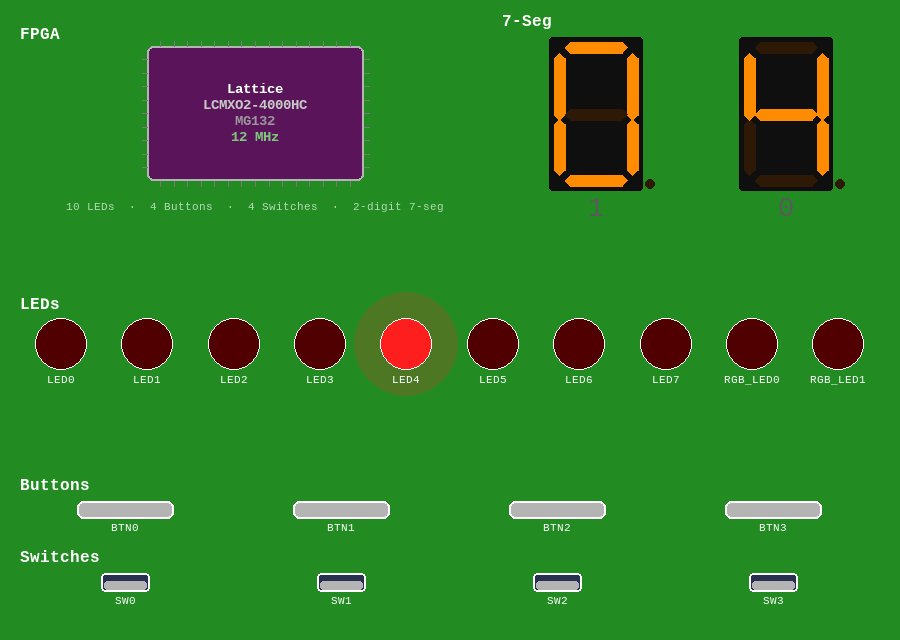
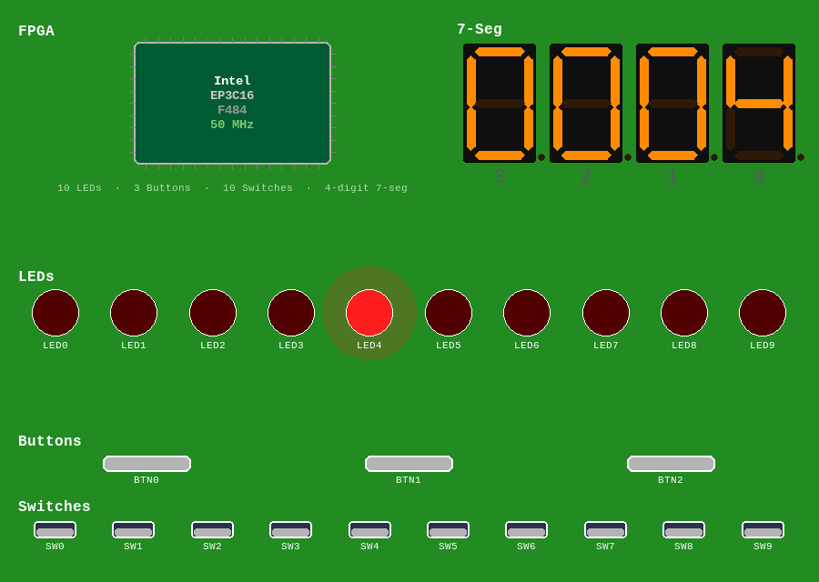
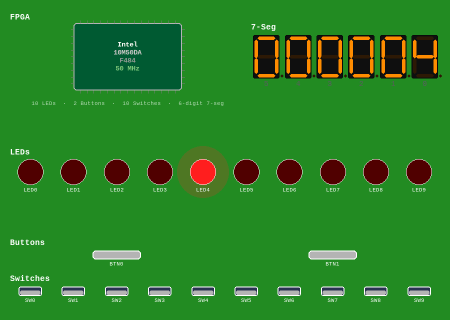

# Embedded Core System Development Guide

> **Companion:** [`embedded_core_system_plan.md`](embedded_core_system_plan.md) — the implementation
> plan, staging, and risk register.
>
> *A guide to building a single-file VHDL design that runs an assembled program on a soft-core CPU,
> driving a virtual FPGA board's switches, buttons, LEDs, and 7-segment displays through an
> IO subsystem (memory- or port-mapped). The generator (`scripts/gen_embedded_core.py`) is built; the worked
> examples are a **6502 (mx65)** and a **Z80 (T80)** running the same walking counter from a shared,
> core-agnostic skeleton. Wherever the two cores differ, the guide calls out what a **third** core
> would change — the goal is that you can drop in any VHDL CPU by vendoring it and writing one small
> bus adapter.*

## 1. Overview & goals

A normal design in this simulator is a hand-written VHDL behavior (see `hdl/blinky.vhd`). An
**embedded core system** instead puts a **CPU** on the board and lets **software** (machine code
in an embedded ROM) produce the behavior, sensing inputs and driving outputs through an **IO
subsystem**. The whole thing — CPU core, ROM, RAM, IO, and a top wrapper — is emitted as **one
`.vhd` file** you select in the simulator like any other design.

You will learn to: choose a CPU core that fits the simulator; design a memory + IO map; write a
power-on reset and cold-start; write firmware that senses `sw`/`btn` and drives `led`/`seg`;
assemble it; embed the bytes as a ROM; generate the single file; and verify it.

**The single-file rule is the dominant constraint.** `sim_bridge.py` analyzes exactly one user
`.vhd`. VHDL lets one file hold many entities/architectures, so the CPU core, ROM, RAM, IO, and
top all live in that one file.

> **Quickstart — your first change** (five steps, a few minutes):
>
> 1. Run an existing design: `uv run fpga-sim`, pick any 7-segment board, select
>    `hdl/mx65_hello_7seg.vhd`. LED0 lights and digit 0 shows "0".
> 2. Open `firmware/mx65_hello_7seg.s` and find `GLYPH0: .byte $3F` (the digit-0 glyph) or
>    `LED_LO`/`lda #$01` (which LED lights).
> 3. Change the glyph byte (e.g. `$06` for "1") or the LED value (e.g. `#$02` for LED1).
> 4. Assemble (`firmware/README.md` has the exact command) and regenerate:
>    `uv run python scripts/regen_embedded_cores.py --write`.
> 5. Rerun the simulator on `hdl/mx65_hello_7seg.vhd` and watch your change take effect.
>
> That is the whole edit → assemble → regenerate → run loop every firmware change in this guide
> follows (§10 has the toolflow diagram) — the rest of this document is what happens when the
> change is bigger than one byte.

## 2. Prerequisites — the simulator contract

A design the simulator accepts must satisfy (see `CLAUDE.md` and `hdl/counter_7seg.vhd`):

- **Filename = top entity name.** `mx65_walking_counter_7seg.vhd` ⇒ `entity mx65_walking_counter_7seg`.
- **Top generics:** `NUM_SWITCHES, NUM_BUTTONS, NUM_LEDS, NUM_SEGS, COUNTER_BITS` (all `positive`).
  The simulator computes these from the selected board and passes them by name. You may ignore
  `COUNTER_BITS`. Extra top generics are fine if they have defaults — but the wrapper passes
  *only* the five above, so an extra generic like `PRESCALER_BITS` keeps its VHDL default and is
  effectively **fixed at generation time, not adjustable from the UI**.
- **Top ports:** `clk : in std_logic`; `sw : in std_logic_vector(NUM_SWITCHES-1 downto 0)`;
  `btn : in ...(NUM_BUTTONS-1 ...)`; `led : out ...(NUM_LEDS-1 ...)`;
  `seg : out std_logic_vector(8*NUM_SEGS-1 downto 0)` (7-seg boards only).
- **`seg` packing:** digit *i* occupies bits `[8*i+7 : 8*i]`; within a digit `bit7=dp,
  6=g,5=f,4=e,3=d,2=c,1=b,0=a`, **active-high**; **digit 0 = rightmost**. The simulator applies any
  board-level active-low inversion and multiplexing for you — always drive active-high per-digit
  bytes.
- **Clock only.** The auto-generated wrapper (`sim/sim_wrapper_template.vhd`) drives `clk`
  (period from the board's default clock, adjustable by the speed slider). There is **no reset
  input** — you synthesize one (§5).
- **VHDL-2008**, `ieee.std_logic_1164` + `ieee.numeric_std`. Analysis runs `ghdl -a --std=08` /
  `nvc --std=2008 -a` **without `-fsynopsys`** — so the Synopsys packages
  `std_logic_unsigned`/`std_logic_arith`/`std_logic_signed` are **not available**.

The contract check is a lenient whole-file text scan: it only needs one `entity <stem> is`
matching the filename and the tokens `clk/sw/btn/led` to appear somewhere. A CPU core with
different port names (mx65 uses `clock/reset/ce/...`) coexists fine.

## 3. Anatomy of a generated system

The generator concatenates into one file: a banner, the **vendored CPU core** (verbatim), then four
generated blocks — `cpu_rom`, `cpu_ram`, `cpu_io`, and the **top**. The trick that lets one skeleton
host different CPUs: the ROM/RAM/IO and address decode all speak a **normalized internal bus**, and a
small per-core **adapter** translates that bus to the specific core's pins.

```text
   +------------------------- top (entity = filename) --------------------------+
   |  clk --> [ POR ] --> cpu_reset (active-high, normalized)                    |
   |                                                                            |
   |    +----------------------+     normalized bus     +--- decode + read mux -+|
   |    |  per-core ADAPTER     |  cpu_addr / cpu_din /  |  cpu_rom | cpu_ram |  ||
   |    |  (a VHDL `block`)     |<-cpu_dout / cpu_we  -->|  cpu_io (regs+timer) |||
   |    |   instantiates mx65   |  cpu_reset/cpu_irq_req |          |           ||
   |    |         or T80        |                       +----------|-----------+|
   |    +----------------------+                                   v            |
   |  sw/btn ---------------------------------------------> cpu_io ---> led/seg  |
   +----------------------------------------------------------------------------+
```

- **Normalized bus.** `cpu_addr(15:0)`, `cpu_din(7:0)` (to CPU), `cpu_dout(7:0)` (from CPU), `cpu_we`
  (active-high write strobe), `cpu_reset` (active-high), `cpu_irq_req` (active-high). Every generated
  block uses these names, so they are **core-independent**.
- **Per-core adapter** (`scripts/embedded_core/adapters/<core>.vhd`): a self-contained VHDL `block`
  that instantiates the core and wires it to the normalized bus, converting reset polarity, the write
  strobe, the interrupt polarity, and the bus protocol (§4). This is the *only* core-specific VHDL —
  the whole "port to a new CPU" job.
- **`cpu_rom`** — combinational read (§4 *Bus read timing*); program + LUTs, embedded from the
  firmware `.bin`. **`cpu_ram`** — combinational read, registered write, zero-initialized. **`cpu_io`**
  — address-decoded registers (sw/btn/config/tick reads, led/seg writes) + the prescaler + (optionally)
  a small interrupt controller (§9).
- **POR** — a counter that holds `cpu_reset` asserted for the first few clocks (§5).
- **Decode + read mux** — **generated from the system memory map** (so the 6502's and Z80's different
  maps both work); combinational, default `x"00"` so the bus is never `'U'`.

## 4. Adding a CPU core (the core-agnostic part)

Porting to a new CPU is **two files**: vendor the core under `cores/`, and write a bus adapter under
`adapters/`. The ROM/RAM/IO, address decode, and firmware toolchain don't change. mx65 (6502) and
T80 (Z80) are the two worked examples; a third core follows the same recipe.

### 4.1 Requirements for a core

1. **VHDL** (GHDL/NVC are VHDL simulators; Verilog cores don't apply).
2. **Analyzes under `--std=08` / `--std=2008` with no `-fsynopsys`** and no vendor primitives
   (`altsyncram`, Lattice/Xilinx macros). Standard `std_logic_1164` + `numeric_std` is ideal; a core
   that pulls in Synopsys `std_logic_unsigned`/`std_logic_arith` can usually be **standardized**
   (§4.2).
3. **A documented synchronous bus**: address out, data in/out, a read/write strobe, reset, and a
   level-sensitive interrupt line if you want interrupts.
4. **A redistributable license** (MIT/BSD) so the core can be vendored with its notice kept.

### 4.2 Vendoring the core

Copy the core VHDL under `scripts/embedded_core/cores/<core>/` (or a single file), **keeping its
license header** — it travels into every generated design. Then:

- **Pin the upstream commit** and record it (mx65's header; T80's `cores/t80/PROVENANCE.md`) so a
  test can guard against silent re-vendoring.
- **ASCII only, no BOM** — the simulator's gate (`check_vhdl_encoding`) rejects non-ASCII; sanitize a
  core with accented bytes and note it as a patch.
- **Multi-file cores are fine** — list the files **leaf-first**; the generator concatenates them
  (T80 = `T80_Pack`, `T80_ALU`, `T80_MCode`, `T80_Reg`, `T80`, `T80s`).
- **Synopsys → standard patch.** If the core uses `IEEE.STD_LOGIC_UNSIGNED`, swap it for the
  VHDL-2008 standard `IEEE.NUMERIC_STD_UNSIGNED` (same `std_logic_vector` unsigned arithmetic, no
  `-fsynopsys`). This worked verbatim for T80 because it uses no `std_logic_arith`-only helpers
  (`conv_integer`, …); if a core does, translate those to `to_integer`/`to_unsigned` too. **Document
  every change to the vendored bytes**; the integrity test checks the pinned commit *and* that the
  core still analyzes under both simulators.

### 4.3 The `CpuPlugin`

`scripts/embedded_core/cpu_plugin.py` describes each core — its files, its adapter, and the facts the
generator documents (reset polarity, boot behavior):

```python
MX65 = CpuPlugin(name="mx65", entity_name="mx65",
                 core_files=(_CORES / "mx65.vhd",),
                 adapter_file=_ADAPTERS / "mx65.vhd")            # reset active-high, boots at $FFFC

T80  = CpuPlugin(name="t80", entity_name="T80s",
                 core_files=(_T80/"T80_Pack.vhd", ..., _T80/"T80s.vhd"),
                 adapter_file=_ADAPTERS / "t80.vhd",
                 reset_active_high=False, boots_at_zero=True)    # RESET_n low, boots at $0000
```

`--cpu <name>` on the generator selects it.

Most of these fields are **documentation only**: `address_bits`, `data_bits`, `reset_active_high`,
`irq_active_high`, and `endian` are facts the adapter VHDL already implements, so changing a field's
value here has no effect on the generated design (they're candidates to become functional with the
P8 normalized-bus-v2 work). `boots_at_zero` is the exception — the generator consumes it to enforce
where ROM must sit (§6).

### 4.4 The bus adapter — the heart of "any core"

The adapter is a self-contained VHDL `block` (it may declare local signals, so the whole port is one
block) that plugs the core into the **normalized bus** (§3). It must: drive `cpu_addr`, read
`cpu_din`, drive `cpu_dout`; produce **`cpu_we`** (active-high write strobe); consume **`cpu_reset`**
(active-high POR) and **`cpu_irq_req`** (active-high) at the core's polarities. The two cores show how
different a bus can be:

| Normalized | mx65 (6502) | T80 (Z80) |
|---|---|---|
| reset | `reset => cpu_reset` (active-high) | `RESET_n => not cpu_reset` (active-low) |
| write strobe | `cpu_we <= not rw` (rw: 1=read) | `cpu_we <= (not WR_n) and (not MREQ_n)` |
| read | combinational `data_in <= cpu_din` | combinational `DI <= cpu_din` |
| irq | `irq => not cpu_irq_req` (active-low) | `INT_n => not cpu_irq_req` (active-low) |
| boot | fetches PC from `$FFFC/D` | starts executing at `$0000` |

```vhdl
-- adapters/mx65.vhd
cpu_core : block
  signal cpu_rw : std_logic;
begin
  cpu : entity work.mx65 port map (
    clock => clk, reset => cpu_reset, ce => '1',
    data_in => cpu_din, data_out => cpu_dout, address => cpu_addr,
    rw => cpu_rw, sync => open, nmi => '0', irq => not cpu_irq_req );
  cpu_we <= not cpu_rw;
end block;
```

A Z80 can reach IO two ways: **memory-mapped** loads/stores (as here, shared with the 6502) or
**port-mapped** `IN`/`OUT` in the `IORQ_n` space (§6, *Port-mapped IO*). This base adapter is the
memory-mapped one; each (interrupt mode × IO transport) combination that changes the pin-level wiring
is a small adapter variant (§4.6).

### 4.5 Bus read timing — the deepest pothole

Simple cores use a *same-cycle* read bus: the core drives `address` and expects the byte on `data_in`
**within the same clock cycle**, so ROM/RAM/IO and the read mux must be **combinational** (address in
→ byte out, no output register). A registered ("synchronous") memory returns data a cycle late and
the core executes garbage from the first fetch. Combinational read is the safe default for both cores;
real hardware uses registered block-RAM + a wait state, not needed in sim.

> **Multi-cycle reads bite read-to-clear registers.** The 6502's read is one clock; the Z80's is
> several. A **read-to-clear** status bit clears on the *first* clock of the Z80's multi-cycle read —
> before the core samples it — so a poll loop hangs forever. Use **write-to-clear** for status/ack
> registers (poll to check, write to acknowledge): correct for any core, and what `cpu_io`'s tick and
> interrupt-flag registers do (§6, §9). This one bug cost the Z80 bring-up a debugging session.

### 4.6 Adapter variants — interrupt mode × IO transport

A core's adapter can have **variants** for optional features selected by the spec (§10): the
**interrupt mode** (`irq_mode`) and the **IO transport** (`io_transport`). Each combination that
changes the *pin-level* wiring is one adapter file, and the generator picks it from the plugin. The
T80 ships all four; the mx65 (no I/O space, fixed IRQ vector) needs only the base one:

| adapter | interrupt | IO transport | what it adds over the base |
|---|---|---|---|
| `t80.vhd` | none / simple | memory-mapped | the base bus translation |
| `t80_vectored.vhd` | vectored (IM 2) | memory-mapped | muxes a vector onto `DI` during INTA (§9) |
| `t80_port.vhd` | none / simple | port (IORQ) | exposes `MREQ`/`IORQ` for the decode split (§6) |
| `t80_vectored_port.vhd` | vectored | port | both at once (`M1_n` keeps INTA and `IN`/`OUT` apart) |

The plugin names the variant files (`vectored_adapter_file`, `port_adapter_file`,
`vectored_port_adapter_file`); a core that supports neither feature leaves them unset, and the
generator rejects that combination with a clear error. Everything *above* the pins — the interrupt
controller, the register file — is the same generated VHDL no matter which adapter is chosen.

**Coverage note:** every combination above is exercised by a committed design and test *except*
`irq_mode = "simple"` (Z80 IM 1) on the base `t80.vhd` — it uses the same emitter branch the mx65
IRQ design already exercises, so the path is generator-supported, but no `systems/*.toml` currently
selects it. Treat it as declared-but-unexercised until a committed IM 1 design lands.

## 5. Reset & cold-start (generalized)

**Every CPU has a boot convention.** Identify, for your core: where it fetches the initial PC
(the **reset vector**), how the **stack pointer** initializes, which **mode flags** need setting,
and how **interrupts** are enabled/disabled. Then make the hardware assert reset at power-on and
make the firmware satisfy the rest.

**Synthesizing reset from a clk-only wrapper.** The simulator gives you no reset line, but
GHDL/NVC honor **signal initial values** in simulation. A tiny power-on-reset counter:

```vhdl
signal por_cnt   : unsigned(2 downto 0) := (others => '0');  -- 0 at t=0
signal cpu_reset : std_logic := '1';                         -- asserted at t=0
process(clk) begin
  if rising_edge(clk) then
    if por_cnt /= "111" then por_cnt <= por_cnt + 1; end if;
  end if;
end process;
cpu_reset <= '1' when por_cnt /= "111" else '0';
```

This holds reset high ~7 clocks, then releases it. **Size the counter to your core's actual reset
requirement** — "7" is a starting guess; widen it if the PC never loads from the reset vector.
(This is **sim-only** — it relies on init values rather than an external reset pin. That is exactly
the simulator's model; on real hardware you'd wire a reset controller.)

The POR is **core-agnostic**: it drives the normalized active-high `cpu_reset`, and the adapter
(§4.4) converts polarity — mx65 takes it directly, T80 inverts it to `RESET_n`. Seven clocks proved
enough for both cores; widen `por_cnt` if a core needs a longer reset.

**6502 reset vector & cold-start.** On reset the 6502 loads PC from **`$FFFC/$FFFD`**
(little-endian). Your ROM must place a valid address there pointing at your cold-start routine.
Cold-start should:

```asm
RESET:  SEI            ; mask IRQ (polling model)
        CLD            ; clear decimal mode (defined state)
        LDX #$FF
        TXS            ; stack pointer -> $01FF
        ; ... read config regs, zero variables, set initial direction ...
        JMP MAIN
```

**Shortcuts (when authenticity isn't required):** skip `CLD` if you never use decimal mode; leave
IRQ/NMI vectors pointing at a single `RTI` if you don't use interrupts (but they must still be
*valid* bytes, or a stray interrupt/BRK runs garbage). For learning, prefer the full sequence and
real handlers.

**Z80 cold-start (the second core, for contrast).** The Z80 has **no reset vector** — it just starts
executing at **`$0000`**, so ROM sits at the bottom of the map (§6) and the program's first byte *is*
its reset code. Cold-start: `DI` (we poll), `LD SP, <top-of-RAM>` (the Z80 leaves SP undefined on
reset), then read config and init variables. No `$FFFC`-style vector to place, and interrupt entry
points ($0038 for IM 1, $0066 for NMI) matter only if you enable interrupts.

**Metavalue (`'U'`) hygiene — a simulation-only hazard.** GHDL/NVC start every `std_logic` at
`'U'` (uninitialized), which has no hardware analog. If a `'U'` reaches the CPU's `data_in` — an
uninitialized RAM read used as an operand or jammed into the PC — it propagates through the entire
datapath and **never resolves**, so the display simply freezes or goes blank. Defend against it:
initialize the RAM array to `x"00"`, drive the read mux's default branch to `x"00"`, synthesize the
POR so the CPU starts defined, and have cold-start zero the variables it reads. When a CPU design
"does nothing," suspect a `'U'` on the bus first (§14, and *Debugging with waveforms*).

## 6. Memory & IO map design

Decode the address bus into regions, and put ROM **where the core boots**: top of memory for the
6502 (so its `$FFFA–$FFFF` vectors live in ROM), or **`$0000`** for the Z80 (which boots there, with
RAM/IO moved up). The decode lines are **generated from the spec's memory map**, so a different core's
map is just different base addresses. Example 6502 map:

- **RAM `$0000–$07FF`** — zero page (`$00–$FF`), stack (`$0100–$01FF`), variables.
- **IO `$E000–$E0FF`** — registers below.
- **ROM `$F800–$FFFF`** — program, LUTs, and the vectors at `$FFFA–$FFFF`.

**IO registers** (offset from `$E000`):

| Addr | Dir | Function |
|---|---|---|
| `$E000`/`$E001` | R | switches (low/high byte) |
| `$E002`/`$E003` | R | buttons (low/high byte) |
| `$E004..$E007` | R | **config**: NUM_LEDS, NUM_SEGS, NUM_SWITCHES, NUM_BUTTONS |
| `$E008` | R | LFSR random byte -- only when the spec lists the `"lfsr"` peripheral (§13) |
| `$E010` | R/W | tick pending in bit0; **write any value to clear** (§4.5) |
| `$E020`/`$E021` | W | LED bits (low/high byte), masked to NUM_LEDS |
| `$E030+i` | W | segment byte for digit *i* (active-high, `dp g f e d c b a`) |

**Config registers** make one generated file work on any board: firmware reads NUM_LEDS/NUM_SEGS
at boot and adapts (essential for the walking LED, which must know how many LEDs to traverse).
**Generic sizing:** `cpu_io` carries `NUM_*`; it zero-extends narrow `sw`/`btn` inputs to a byte,
masks `led` to `NUM_LEDS`, and exposes `seg_regs(0..NUM_SEGS-1)` packed to `seg` (digit 0 =
rightmost, no reversal). **Vector placement:** the assembler must emit the reset/IRQ/NMI addresses
at `$FFFC/D`, `$FFFE/F`, `$FFFA/B`.

**Memory-map rules (enforced by the generator at load/generate time):** every region's `size` must
be a power of two and its `base` a multiple of that size; every region must fit within the 64 KB
address space; ROM, RAM, and IO (in `memory` transport) must not overlap each other. **ROM and RAM
sizes are independent** — each region's address slice in the top is generated from its own size, so
ROM and RAM never need to match. ROM must sit where the core boots, checked against the plugin's
`boots_at_zero` (§4.3): `$0000` for a boots-at-zero core, or ending at `$10000` for a vector-fetch
core. The assembled firmware image must fit inside the `rom` region's `size`. Any violation raises a
`ValueError` naming the offending region; an unknown or typo'd key anywhere in the spec (top level,
`[generics]`, or a `memory.*` table) is rejected the same way rather than silently ignored.
**Exception:** with `io_transport = "port"` the `io` region describes the Z80's separate I/O space,
not a slice of the 64 KB memory map, so it is exempt from every rule above — the committed port-IO
specs legitimately place it "under" ROM.

### Port-mapped IO — the transport axis

The 6502 has only memory-mapped IO, but the Z80 has a **separate I/O space** reached with `IN`/`OUT`
(which assert `IORQ_n`, not `MREQ_n`). The `io_transport` spec field selects which the generated
design uses:

- **`memory`** (default) — the IO window is an address range (`$E000` above); the 6502 and Z80 both
  work this way and `cpu_io`'s chip-select comes from the address decode.
- **`port`** (Z80 only) — the register file moves into the I/O space; the select comes from the
  **I/O cycle** (`IORQ`) instead, and ROM/RAM stay in the memory space. The decode becomes the
  textbook Z80 split: ROM/RAM selects qualified by **MREQ**, and `sel_io` taken from the **IORQ**
  cycle (with `M1_n` high to exclude the interrupt-acknowledge cycle, §9). The `t80_port` adapter
  exposes `cpu_mreq`/`cpu_iorq` for exactly this.

**`cpu_io` itself is unchanged** — same registers at the same offsets (`$00`=SW … `$30`=SEG, now
*port* numbers); only *how it is selected* differs, so the register file is genuinely transport-
independent. The firmware swaps loads/stores for `IN`/`OUT` (e.g. `LD A,($E000)` → `IN A,($00)`; a
C-indexed `OUT (C),A` walks the segment ports). This is the sharpest view of the seam: the IO block
is core- and transport-agnostic; reaching it is the adapter's job.

## 7. Writing firmware

**Start with the smallest thing that proves the IO path** — the firmware equivalent of `blinky`
(this is also plan Stage 1, and now a committed design: `firmware/mx65_hello_7seg.s`, generated as
`hdl/mx65_hello_7seg.vhd`). Light one LED and write one fixed digit, then spin:

```asm
RESET:  SEI
        CLD
        LDX #$FF
        TXS               ; init stack
        LDA #$01
        STA $E020         ; LED0 on
        LDA #$3F          ; glyph for "0"
        STA $E030         ; digit 0
SPIN:   JMP SPIN          ; mx65 keeps fetching; display holds
```

If that shows one steady LED and a "0", your reset vector, POR, read path, and IO writes all work —
everything else is incremental. Run it yourself (`uv run fpga-sim`, pick `hdl/mx65_hello_7seg.vhd`),
or see the Quickstart box after §1 for the five-step edit loop. Start your own firmware by copying
`mx65_hello_7seg.s`, `systems/mx65_hello_7seg.toml`, and the assemble command in
`firmware/README.md`. Now the full walking-counter patterns (6502, but the shapes generalize). The
canonical assembled source lives in `firmware/mx65_walking_counter_7seg.s`; the sketches below are
the algorithm, not final opcodes.

- **Poll the tick** (decouples visible rate from instruction speed):

  ```asm
  WAIT: LDA $E010      ; bit0 = tick pending
        AND #$01
        BEQ WAIT
        STA $E010      ; ack: a write clears it (§4.5 — safe for multi-cycle-read CPUs)
  ```

- **Query config for board-independence:** `LDA $E004 → N_LEDS`, `LDA $E005 → N_SEGS` at boot.
- **Button edge-detection** (software rising edge): read `$E002`, compare bit0 against the stored
  `PREVBTN`; on a 0→1 transition toggle `FWD` and `CNT_UP`; then store the new value in `PREVBTN`.
  Buttons are sampled **once per tick** (not every clock like the reference RTL), so a press must be
  held ≥ 1 tick to register — fine for a human, but automated tests must hold `btn` across a tick.
- **Bounce state machine:** advance `POS`; at `0` or `N_LEDS-1` flip `FWD`. Assumes
  **`NUM_LEDS ≥ 2`** — on a 1-LED board this underflows and the LED goes dark (the 7-seg odometer is
  unaffected); every 7-seg board satisfies this, but since any design can run on any of the 278
  boards, a 1-LED non-7-seg board is a known gap, not a guarantee.
- **BCD ripple** (decimal odometer): increment digit 0; on `>9` set 0 and carry into the next
  digit across `N_SEGS`; decrement mirrors with borrow (`<0` → 9). Wrap is natural.
- **Render digits via ROM LUT:** `LDX BCD[i]; LDA DECLUT,X; STA $E030,Y` (`DECLUT` = the ten
  glyph bytes from `walking_counter_7seg.vhd`). **One-hot LED:** compute `1<<POS` → `$E020`
  (+`$E021` if `N_LEDS>8`).
- **Lamp-test:** if `btn(1)` set, write `$FF` to all digit regs and all LED bits.
- **Switch speed:** popcount `sw` (= `P`), set `SKIP = max(1, SKIP_BASE >> P)` (e.g. `SKIP_BASE=8`)
  and treat only every `SKIP`-th tick as a step, so **each active switch halves `SKIP` and doubles
  the rate** — matching `walking_counter_7seg.vhd`'s `idx := base - n`. (The RTL originally
  quadrupled per switch despite its "doubles" comment; fixed in #133, so the firmware's always-2x
  choice now matches the RTL exactly rather than deliberately diverging from it.)

## 8. Assembler & ROM embedding

**The project consumes a ROM *image*, not assembly source.** Pick any assembler that emits bytes;
the generator just needs `{bytes, load address, vector values}`.

| Option | Pros | Cons |
|---|---|---|
| **Vendored pure-Python** | self-contained, in-repo, unit-testable, CI-clean | ~300–500 lines to maintain; one ISA |
| **ca65 (cc65)** | industry standard, macros, linker | external toolchain in dev + CI |
| **customasm** | single binary, **ISA described in a ruledef** — great for many CPUs | non-Python binary per OS; author rulesets |
| **hand-assembled** | zero tooling | error-prone; not general |

**Recommendation:** the worked example uses **`ca65` (cc65)** as an external dev-time tool (the
plan keeps an assembler out of the project's dependencies, so reassembly is not in CI — the
checked-in `.bin` is the source of truth). For the long-term multi-CPU vision, `customasm` is
attractive (one ruledef per ISA). Whatever you use, **check in the `.asm`, the assembled bytes,
and the exact command** so the image is reproducible.

**The assembler is per-ISA, and that's fine** — the generator only ever sees the `.bin`. The 6502
uses `ca65`/`ld65` (cc65); the Z80 uses z88dk's `z80asm` (`z80asm -b -o<bin> file.asm`, with `org 0`
and `defc NAME = value` for constants). Both are external dev-time tools; the checked-in `.bin` is
the source of truth, so CI never needs the assembler.

**Embedding as a VHDL ROM** — sparse named association keeps it small regardless of ROM size:

```vhdl
type rom_t is array(0 to 2**ROM_BITS-1) of std_logic_vector(7 downto 0);
constant ROM : rom_t := (
  16#000# => x"78",  -- SEI ...
  -- vectors (ROM base $F800; offset = addr-$F800):
  16#7FC# => x"00", 16#7FD# => x"F8",   -- RESET -> $F800
  16#7FE# => x"40", 16#7FF# => x"F8",   -- IRQ/BRK -> handler
  16#7FA# => x"40", 16#7FB# => x"F8",   -- NMI -> handler
  others => x"00");
```

Unit-test the bytes: assert the vectors land at the right offsets and that `DECLUT` equals
`walking_counter_7seg`'s `SEG_LUT(0..9)`.

## 9. Timing & throughput

The simulator runs sub-real-time: a per-frame cap of ~9596 clocks at ~60 fps gives a ceiling
≈ **575k simulated clocks/second** at the top slider position (far less at default). A 6502 uses
several clocks per instruction, so **don't busy-wait** millions of cycles for visible motion.

**Use a hardware prescaler tick.** A free-running divider raises a tick every `2^PRESCALER_BITS`
clocks; the firmware polls it (write-to-clear). The visible step rate then equals the tick rate and
is independent of how long your loop is:

| `PRESCALER_BITS` | clocks/tick | steps/s @ top slider |
|---|---|---|
| 8 | 256 | ~2250 (CPU-capped) |
| **10 (default)** | 1024 | ~560 |
| 12 | 4096 | ~140 |

Expose `PRESCALER_BITS` as a generic (default 10). The speed slider scales sim-time; switch-based
software division multiplies the rate further.

**Polling vs. interrupts.** Start with **polling** — no ISR, no reentrancy. The interrupt-driven
variant (`mx65_irq_counter_7seg`) instead builds a small **interrupt controller** in `cpu_io` with
**two sources** on the one IRQ line: a **timer** (the prescaler tick) and an **input-change**
detector (any `sw`/`btn` edge, caught in hardware — the "additional circuitry" a real peripheral
needs). Each source has an enable bit (**IER**, `$E011`) and a flag bit (**IFR**, `$E012`,
write-1-to-clear); `irq` is the OR of enabled+pending flags, and the ISR **reads IFR to learn which
source fired** and dispatches — the real "which peripheral interrupted?" pattern (like a disk
controller signalling "data ready"). The adapter routes the normalized active-high `cpu_irq_req` to
the core's line (`not cpu_irq_req` for both the 6502's and the Z80's active-low inputs). Firmware:
enable the source in the peripheral (IER) *and* enable the CPU (`CLI` / `EI`), then ack in the ISR.

### Vectored interrupts — the interrupt-mode axis

The controller above is the **`irq_mode = "simple"`** shape: one IRQ line, one handler that reads IFR
to dispatch. It maps to a **single fixed vector** — the 6502's `$FFFE` IRQ vector, or the Z80's
**interrupt mode 1** (`RST 38h`). **`irq_mode = "vectored"`** instead uses the Z80's **interrupt mode
2**, where the *peripheral* supplies a vector so the *hardware* dispatches:

- On interrupt the Z80 runs an **interrupt-acknowledge cycle** (INTA = `M1_n` **and** `IORQ_n` low —
  a combination that occurs nowhere else). The `t80_vectored` adapter detects it and drives the
  controller's **vector byte** onto `DI`.
- The controller priority-encodes a vector per source (**timer → `$00`, input → `$02`**). The Z80
  forms `I:vector` (the `I` register is the high byte), reads the 2-byte ISR address from that table
  entry, and jumps — so **timer and input dispatch to *separate* ISRs**, no IFR read needed. Firmware
  sets `I`, a page-aligned vector table (`$0100` here), then `IM 2` + `EI`.
- Each ISR still **acks its source** by write-to-clear on IFR (§4.5) and ends with `RETI`.

Because `M1_n` cleanly separates the Z80's two `IORQ` uses — INTA (`M1_n` low) supplies the vector;
`IN`/`OUT` (`M1_n` high) select port IO — vectored interrupts and port IO **compose** into one
"realistic Z80 machine" (`t80_irq_portio`, §12) with only a combined adapter, no new generator logic.

## 10. Generating the file

Where §3's diagram shows the **hardware** inside the generated file, this is the **toolflow** that
produces it:

```text
firmware/<name>.s|.asm ──(ca65+ld65 / z80asm, dev-time)──► firmware/<name>.bin ─┐
scripts/embedded_core/cores/<core>/  (vendored VHDL, verbatim) ─────────────────┼─► gen_embedded_core.py ─► hdl/<name>.vhd ─► simulator
systems/<name>.toml  (memory map + irq_mode/io_transport axes) ─────────────────┘        (validate-then-write)
```

```bash
uv run python scripts/gen_embedded_core.py --system systems/mx65_walking_counter_7seg.toml
```

`--cpu`, `--rom`, and `--out` are inferred from the spec (`spec.cpu`; `firmware/<spec.firmware>.bin`;
`hdl/<spec.name>.vhd`) — the short form above is all you need for a spec that already exists.
Override any of them explicitly for a different ROM image or output path:

```bash
uv run python scripts/gen_embedded_core.py \
    --cpu mx65 \
    --system systems/mx65_walking_counter_7seg.toml \
    --rom    firmware/mx65_walking_counter_7seg.bin \
    --out    hdl/mx65_walking_counter_7seg.vhd
```

Inputs: a **CPU plugin** (`--cpu`: vendored core files + adapter), a **system spec** (memory + IO
map, `prescaler_bits`, and the two feature axes), and a **ROM image**. Output: the single
generic-parameterized `.vhd`, validated against the contract checker before writing. A spec whose
`cpu` field is `t80` generates a Z80 build with no `--cpu` needed; an explicit `--cpu` that
disagrees with the spec fails fast. Two spec fields select the optional features:

- **`irq_mode`** — `"none"` (polled, default), `"simple"` (one fixed-vector handler: 6502 IRQ or
  Z80 IM 1), or `"vectored"` (Z80 IM 2, §9).
- **`io_transport`** — `"memory"` (memory-mapped, default) or `"port"` (Z80 `IN`/`OUT`, §6).

The generator selects the matching adapter variant (§4.6); an unsupported combination for the chosen
core fails fast with a clear error.

**Regenerating everything at once:** `uv run python scripts/regen_embedded_cores.py` loops over
every `systems/*.toml` and reports `OK` / `DIFFERS` / `MISSING` for each (default: check only, exits
nonzero on any difference); `--write` regenerates drifted or missing files in place; `--assemble`
additionally reassembles each firmware source with its pinned dev-time toolchain and reports drift
against the checked-in `.bin` (it never writes a `.bin` — that stays a deliberate manual act).

**Generator internals — where the VHDL lives:** `emitter.py` fills each `templates/*.vhd.tmpl` file's
`@@TOKEN@@` markers (`_fill`) and concatenates the results (`emit`, §3's leaf-first order). Short,
purely-connective token values (a decl line, a port addition) stay inline Python strings in
`emitter.py`. Multi-line VHDL *bodies* — currently the interrupt controller's signals, read-mux arm,
process, and IM 2 vector encoder — instead live as separate `templates/fragments/*.vhd.frag` files,
loaded by the small `_frag()` helper and spliced into the same tokens. Neither `.vhd.tmpl` nor
`.vhd.frag` files are complete, standalone-analyzable VHDL (they carry `@@TOKEN@@` markers or are
partial design units), so both are on the P7/VSG hard-exclusion list (`improvement_roadmap.md`) —
write them to the ruleset's style by hand. When extending `cpu_io` (§13) with a new multi-line block,
add a fragment rather than growing another Python string literal.

## 11. Running & verifying

- **Interactive:** `uv run fpga-sim` → pick a 7-seg board → select your `.vhd`.
- **Headless GIF:** `uv run python scripts/capture_demo.py --vhdl hdl/mx65_walking_counter_7seg.vhd
  --board de10_lite --sim nvc` (`SDL_VIDEODRIVER=dummy`; board JSON via `FPGA_SIM_BOARD_JSON`).
- **Tests:** `sim/test_cpu_walking.py` (glyphs + advance, one-hot bounce, `btn(0)` reversal,
  `btn(1)` lamp-test) is the **shared** behavioral suite — **all six designs** (6502 polled + IRQ;
  Z80 polled, IM 2, port-IO, and the IM 2 + port capstone) run it (`PASS=4`) under both simulators.
  `tests/test_embedded_core.py` also byte-for-byte golden-tests each generated `.vhd` and checks the
  vendored cores' integrity + standardization.

## 12. End-to-end worked example (the 6502 walking counter)

1. **Vendor** `mx65.vhd` (pin a commit) at `scripts/embedded_core/cores/mx65.vhd`; smoke-test it
   analyzes under GHDL and NVC.
2. **Map** memory/IO as in §6; pick RAM/ROM sizes (2 KB each).
3. **Write** `firmware/mx65_walking_counter_7seg.s` (§5 cold-start + §7 main loop).
4. **Assemble** with `ca65`/`ld65` to `firmware/mx65_walking_counter_7seg.bin` (the source of truth).
5. **Generate** `hdl/mx65_walking_counter_7seg.vhd` (§10).
6. **Verify** (§11): glyphs valid, odometer advances, LED bounces, `btn(0)` reverses, `btn(1)`
   lamp-test; compare side-by-side with `hdl/walking_counter_7seg.vhd`.

The complete, annotated program is the checked-in `firmware/mx65_walking_counter_7seg.s` (the §5/§7
sketches are deliberately partial); `ca65`/`ld65` assemble it to the `.bin` that
`scripts/embedded_core/rom_to_vhdl.py` embeds verbatim as the ROM constant.

### Generic sizing — one design, every board

The same generated `hdl/mx65_walking_counter_7seg.vhd` runs unchanged on boards with different
resource counts: at cold-start the firmware reads `NUM_LEDS`/`NUM_SEGS` from the IO config registers
(§6) and drives exactly that many. Captured headless with `scripts/capture_demo.py` on three boards
that differ only in digit count:

| 2 digits (StepMXO2) | 4 digits (DE0) | 6 digits (DE10-Lite) |
|---|---|---|
|  |  |  |

The bouncing one-hot LED and the decimal odometer are the same firmware, sized at runtime — nothing
in the VHDL or the program is board-specific.

### The same counter on a Z80 (the second core)

Adding a genuinely different core exercised the whole abstraction. The Z80 version is
`systems/t80_walking_counter_7seg.toml` (ROM at `$0000`, RAM `$8000`, IO `$E000`) +
`firmware/t80_walking_counter_7seg.asm` (the same algorithm and subroutines in Z80 assembly, built
with `z80asm`) + the vendored T80 core + `adapters/t80.vhd`. Generate it with `--cpu t80`; it runs
the **same** `sim/test_cpu_walking.py` behavioral suite (`PASS=4`) under GHDL and NVC — identical
on-board behavior, a completely different CPU. Two lessons surfaced only on the Z80: the tick had to
become **write-to-clear** (§4.5), and the memory map flips (**ROM at `$0000`** because the Z80 boots
there). The POR needed no change.

### The Z80 feature variants (IM 2, port IO, and the capstone)

Three more Z80 designs exercise the two feature axes independently and together — each runs the same
`test_cpu_walking` suite (`PASS=4`) under both simulators, so the *behavior* is fixed while the
*machine* changes:

| design | `irq_mode` | `io_transport` | shows |
|---|---|---|---|
| `t80_irq_counter_7seg` | vectored | memory | IM 2 — per-source ISRs via the `I:vector` table (§9) |
| `t80_portio_counter_7seg` | none | port | IO in the I/O space, the MREQ/IORQ decode split (§6) |
| `t80_irq_portio_counter_7seg` | vectored | port | the **capstone** — both, a "realistic" Z80 machine |

The capstone is the shape a real Z80 system (with Z80-family peripherals) takes. It needed no new
generator logic — the vectored and port token sets compose — only the combined adapter
(`t80_vectored_port.vhd`), because `M1_n` keeps INTA and `IN`/`OUT` apart on the shared `IORQ` line.

## 13. Extending

- **New CPUs:** vendor the core (§4.2) + write one adapter (§4.4). Multi-file cores inline
  automatically (T80 = 6 files); a Synopsys-dependent core is standardized with
  `numeric_std_unsigned` (§4.2). The 6502 and Z80 prove the seam holds across very different buses.
- **New subsystems:** extend `cpu_io` with more registers/peripherals (UART, timer-compare, GPIO
  banks) at fresh IO addresses — worked example below. The two-source interrupt controller (§9) is
  the template for adding an interrupt source (enable bit + flag bit + OR into `cpu_irq_req`).
- **Interrupt mode & IO transport:** two spec axes (§10) — `irq_mode`
  (`none`/`simple`/`vectored`) turns on the interrupt controller (and, for `vectored`, the INTA
  vector supply); `io_transport` (`memory`/`port`) picks the IO transport. Each pin-level combination
  is a small adapter variant (§4.6); the firmware supplies the ISR and/or the `IN`/`OUT` accesses.
- **Alternative programs / hex vs BCD:** just firmware + system-spec changes; the VHDL skeleton and
  the adapter are unchanged.

### Worked example: adding a peripheral (the LFSR / dice-roller)

The `peripherals` spec axis (a TOML list, e.g. `peripherals = ["lfsr"]`) splices an optional
CPU-side IO subsystem into `cpu_io` without touching any existing design — empty tokens when the
list is empty keep every other system byte-identical (proved by the golden tests). Adding one is
four pieces; `hdl/mx65_dice_7seg.vhd` / `systems/mx65_dice_7seg.toml` are the committed example:

1. **A fragment triple** (`templates/fragments/lfsr_*.vhd.frag`), spliced via four `cpu_io.vhd.tmpl`
   anchors — `@@PERIPH_SIGNALS@@`, `@@PERIPH_SENS@@`, `@@PERIPH_READ@@`, `@@PERIPH_LOGIC@@` (put any
   new multi-line VHDL body in a fragment, not a Python string literal — §10's "generator internals"
   note): a signal declaration, a sensitivity-list addition, a read-mux `when` arm at a fresh address
   (`$E008`), and the peripheral's own clocked process (a free-running maximal-length LFSR here).
2. **The spec list:** `peripherals = ["lfsr"]` in the system spec, validated against `PERIPHERALS`
   in `system_spec.py` (an unknown name is a clear load-time error, same as `irq_mode`/`io_transport`).
3. **Firmware that uses it:** `firmware/mx65_dice_7seg.s` reads the new register (`LFSR = $E008`) on
   each button press and reduces it to a die face — ordinary memory-mapped IO from the firmware's
   point of view, no different from reading switches or buttons.
4. **Tests:** `sim/test_cpu_dice.py` plus the golden/reassembly/NVC/GHDL wrappers in
   `tests/test_embedded_core.py`, following the same pattern every other system uses.

The dice spec also gives ROM (2 KB) and RAM (1 KB) **different** sizes — the runtime proof, under
both simulators, that Phase 2's per-region address slices really are independent (§6).

**Terminology note:** this `peripherals` axis is CPU-side IO subsystems *inside* the generated
design — unrelated to board-JSON `peripherals` blocks (physical on-board devices like VGA or audio;
roadmap P5's domain). Same word, different layer.

**Reader exercise:** `hdl/stopwatch_7seg.vhd` is the hand-written RTL half of this repo's "same
behavior, hardware vs software" teaching pair — start/stop/reset under button control, the same
interaction style as the dice roller above. Porting it to 6502 or Z80 firmware is left as an
exercise; `firmware/mx65_walking_counter_7seg.s` already shows the full recipe (BCD ripple, edge
detection, switch-speed scaling) for turning this exact kind of RTL into firmware.

## 14. Troubleshooting

| Symptom | Likely cause | Fix |
|---|---|---|
| Analysis fails on the core | Synopsys package / vendor primitive / `--std` mismatch | Use a `numeric_std`-only core; confirm `--std=08`/`2008` |
| Elaborates but display blank | reset never released, or wrong reset vector | Check POR counter; verify `$FFFC/D` bytes point at `RESET` |
| Garbage on the display | bad vectors or uninitialized RAM read as code | Unit-test vector bytes; zero RAM in cold-start |
| Nothing moves | tick never fires, or busy-wait too long | Check prescaler + the write-to-clear ack; lower `PRESCALER_BITS` |
| Too fast / blurred | prescaler too short / slider too high | Raise `PRESCALER_BITS`; lower the speed slider |
| LED stuck at one end | `POS` bound wrong / didn't read `N_LEDS` | Read config reg `$E004`; check bounce limits |
| Works in GHDL, fails in NVC | heap / elaboration differences | NVC already gets `-H 512m`; keep ROM/RAM modest |
| Display dead from the very first frame | Registered (sync) memory → off-by-one read; CPU fetched garbage | Make ROM/RAM/mux read path **combinational** (§4) |
| Display frozen/blank; `data_in` shows `U`/`X` | Metavalue propagation from uninitialized RAM/bus | Init RAM to `x"00"`, mux `else => x"00"`, zero vars in cold-start (§5) |
| `btn(0)` reversal sometimes ignored | Button pulse shorter than one tick (polled once/tick) | Hold ≥ 1 tick; or use the IRQ variant (§9) |
| Poll loop hangs on a multi-cycle CPU (e.g. Z80) | **read-to-clear** status bit clears mid-read, before the core samples it | Make it **write-to-clear**: poll to check, write to ack (§4.5) |
| New core: garbage or writes don't land | bus adapter maps a strobe or polarity wrong | Recheck `adapters/<core>.vhd`: `cpu_we`, reset polarity, irq polarity, address width (§4.4) |
| Core analysis fails on `std_logic_unsigned` | vendored core uses a Synopsys package | Swap to `numeric_std_unsigned` (§4.2); translate any `conv_*` helpers |
| Vectored IRQ jumps to garbage | `I`/vector-table mismatch, or the adapter doesn't drive `DI` on INTA | Set `I` to the table page, put the table at `I:vector`; confirm `t80_vectored` muxes the vector during INTA (§9) |
| Port-IO: `IN`/`OUT` hit ROM/RAM, or IO reads return `x"00"` | decode not split by MREQ/IORQ, or firmware still uses loads/stores | With `io_transport="port"` the decode qualifies ROM/RAM by MREQ and takes `sel_io` from IORQ (§6); use `IN`/`OUT` for IO |

## 15. Debugging with waveforms

When a CPU design misbehaves, dump a waveform and watch the bus — the fastest way to see the reset
fetch and the main loop (flags are version-dependent; check each simulator's `-r --help`):

```bash
# GHDL: write a VCD while running headless
ghdl -r --std=08 --workdir=<wd> sim_wrapper --vcd=cpu.vcd --stop-time=50us
# NVC: write an FST wave
nvc --std=2008 -H 512m -r --wave=cpu.fst --stop-time=50us sim_wrapper
```

Open the trace (GTKWave, Surfer) and watch the core's pins:

- **Reset fetch:** after `cpu_reset` falls, `address` should show `$FFFC` then `$FFFD`, then jump to
  your RESET routine. If not, the POR is too short or the reset-vector bytes are wrong.
- **`sync`** marks opcode fetches — count them to confirm the main loop is looping.
- **`rw`** high = read, low = write — watch a write actually drive `$E020`/`$E030`.
- **`data_in`** showing `U`/`X` is the tell-tale of metavalue propagation (§5) or an off-by-one
  registered read (§4); the design looks "dead" on screen.

A 20–50 µs window at `PRESCALER_BITS=10` captures reset plus several ticks — enough to diagnose most
bring-up failures.
